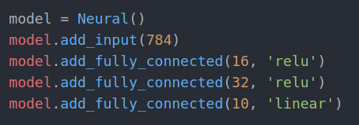

# Hello Neural Network
Implementation of Deep Neural Network able to recognize digits from MNIST database
## Packages
```numpy 1.17.4```

## API


<b>save_network(self, directory)</b> - saves network in files, which will be in <i>directory</i>
  - <i>directory</i> - path to directory, which will contain saved files

<b>load_network(self, directory)</b> - loads network to model, from files located in <i>directory</i>
  - <i>directory</i> - path to directory, which will contain saved files


<b>add_input(self, size)</b> - Adds input layer to model. It must be used before any add_* function. <i>Size</i> indicate to size of input data. Return True if adding layer has been completed with success, otherwise False.
  - <i>size</i> - size of input data

<b>add_fully_connected(self, neurons, activation='linear', left_range=-0.1, right_range=0.1)</b> - Adds fully connected layer. Return True if adding layer has been completed with success, otherwise False.
  - <i>neurons</i> - number of neurons in layer
  - <i>activation</i> - name of activation function, which will be used in added layer
  - <i>left_range</i> - left range used to generate weights values
  - <i>left_range</i> - right range used to generate weights values


<b>predict(self, input_data)</b> - If passed <i>input_data</i> is valid to network structure it returns network answer, otherwise None.
  - <i>input_data</i> - data used as input for network, which answer is returned

<b>fit(self, input_data, expected_data, iterations=100, alpha=0.01, drop_percent=0.5, test_input=None, test_expected=None)</b> - Return True if training has been completed with success, otherwise False.
  - <i>input_data</i> - array of data, where input_data.shape = (number of input data, shape of single data)
  - <i>expected_data</i> - the same structure as in <i>input_data</i>, but here we pass expected data
  - <i>iterations</i> - number of iterations during training
  - <i>alpha</i> - learning rate (0.0-1.0) indicates how fast network should learn
  - <i>drop_percent</i> - drop (0.0-1.0) indicates how much of neurons should be 'dropped', it prevents network from overfitting.
  - <i>test_input</i> - data used for debugging purposes, probably you should omit it
  - <i>test_expected</i> - same issue like in <i>test_input</i>

To pass vectors and matrices use <b>numpy structures</b>

## Briefly about network

Neural Network consists of layers where we can distinguish three types of layers - <b>input</b>, <b>hidden</b>, <b>output</b>. Obviously there is only one input layer and one output, but we can use as many hidden layers as we want. Every layer contains some number of neurons and activation function (except input layer).
<br>

Input layer indicates how input data looks like. So if we have image of digit 28x28px, then we will transform it into vector with 784 elements and this number is a number of "neurons" in input layer.
<br>

As it was said before, we can use any number of hidden layers, and we put them between input and output layer. It is your job to figure out how many hidden layers and number of neurons use. There is additional thing to use - <b>activation</b> function, which says how data are manipulated. Few of them are ready to use in this implementation:
  - linear
  - relu
  - tanh
  - softmax (only for output)

The last one is output layer, which is similar to hidden. Number of neurons here is number of possible answers for our input. In case of digits we want to guess 0-9 digits, then our output will consists of 10 neurons, each corresponding to one digit. It is recommended to use linear or softmax function here.



Here we have built structure of network with where we use 2 hidden layers with relu functions and 16/32 neurons in
hidden layers. So now we can start training and fit function is in charge of it where we are passing parameters as learning rate, drop percent or iterations, which helps us control training flow. But main issue here is passing input training data and expected data. After training, we can use our network to recognize digits from image.
